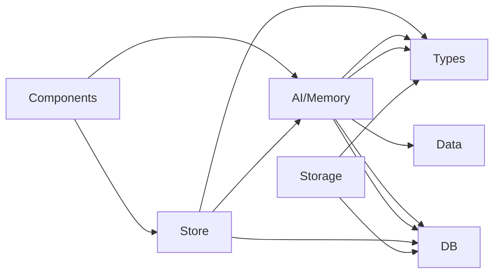

# Codebase Map - VietTruyen
Generated: 2026-05-02

## Project Overview
**VietTruyen** - Desktop application for Vietnamese web novel authors with AI support
- **Framework**: React 18.3.1 + TypeScript + Tauri 2.1.0
- **State Management**: Zustand
- **Database**: Dexie (IndexedDB) + Supabase (cloud sync)
- **Styling**: Tailwind CSS
- **Build Tool**: Vite
- **Testing**: Vitest

## Module Boundaries

| Module | Directory | Public API | Dependencies | Domain |
|--------|-----------|-----------|--------------|--------|
| Core Logic | src/core/ | chapter_summary_generator, debt_tracker, memory_extractor, reflection, scene_chunker, style_engine, writer_engine, writer_strategies, checkers/ | data, types, lib/memory | Story processing logic |
| AI Integration | src/lib/ai/ | chapter_writer_ai, context_builder, creation_orchestrator, novel_polish, surprise_engine, template_injector | types, data, lib/memory | AI orchestration |
| Memory System | src/lib/memory/ | memory_indexer, vector_query, narrative_graph_builder, hybrid_memory_query, retrieval_pack_builder | types/memory_embedding, types/narrative_memory | Narrative memory & RAG |
| Database | src/db/ | narrative_db (Dexie schema) | types/narrative_memory, types/story, types/surgery | Data persistence |
| State Management | src/store/ | use_project_store, use_ai_store, use_creation_chat_store, etc. | types, lib | Application state |
| Components | src/components/ | UI components (pages, story-editor, shared) | store, lib, types | UI layer |
| Data Layer | src/data/ | genre_descriptions, genre_profiles, genre_templates, story_templates, style_presets | types | Static data & templates |
| Storage | src/lib/storage/ | storage_provider, online_storage_provider, narrative_memory_bridge | db, types | File & cloud storage |
| Canon | src/lib/canon/ | canon_bundle | types, data | Story bible management |
| Dashboard | src/lib/dashboard/ | dashboard_metrics | types, store | Analytics & metrics |

## Dependency Graph

## Domain Ownership

| Domain | Modules | Key Files |
|--------|---------|-----------|
| Story Processing | core, lib/ai, lib/memory | src/core/writer_engine.ts, src/lib/ai/chapter_writer_ai.ts, src/lib/memory/memory_indexer.ts |
| Quality Assurance | core/checkers | src/core/checkers/high_point_checker.ts, consistency_checker.ts, pacing_checker.ts, etc. |
| Memory & RAG | lib/memory | src/lib/memory/vector_query.ts, narrative_graph_builder.ts, hybrid_memory_query.ts |
| Data Persistence | db, lib/storage | src/db/narrative_db.ts, src/lib/storage/storage_provider.ts |
| State Management | store | src/store/use_project_store.ts, use_ai_store.ts, use_creation_chat_store.ts |
| User Interface | components, app | src/components/story-editor/, src/components/pages/, src/App.tsx |
| AI Orchestration | lib/ai | src/lib/ai/context_builder.ts, creation_orchestrator.ts, chapter_writer_ai.ts |
| Templates & Data | data | src/data/genre_templates/, src/data/story_templates/ |
| Analytics | lib/dashboard | src/lib/dashboard/dashboard_metrics.ts |

## Key Features (Existing)

### Narrative Memory System
- Vector embeddings with Gemini & OpenRouter adapters
- Narrative graph construction (nodes, edges, communities)
- Hybrid memory query with reranking
- Hierarchical summary cache
- Timeline facts & attribute dependencies

### Quality Checkers (6-dimensional)
- High-point Checker
- Consistency Checker  
- Continuity Checker
- OOC Checker (Out of Character)
- Pacing Checker
- Reader-pull Checker
- Discourse Depth Checker
- Golden Three Checker

### AI Features
- Context builder with hybrid retrieval
- Chapter writer AI with streaming
- Surprise engine for plot twists
- Self-reflection loop
- 8-mode polish system
- Style learning & correction
- Narrative weight scoring

### Storage & Sync
- Dexie IndexedDB for local storage
- Supabase for cloud sync
- Version history with branching
- Narrative memory bridge

## Tech Stack Summary

**Frontend**: React 18.3.1, TypeScript 5.5.3, Tailwind CSS 3.4.10
**Desktop**: Tauri 2.1.0
**State**: Zustand 4.5.5
**Database**: Dexie 4.3.0 (IndexedDB), Supabase 2.99.3
**AI**: Google Generative AI 0.17.1
**Documents**: docx 8.5.0, pdfjs-dist 5.6.205, mammoth 1.12.0
**Build**: Vite 5.4.1
**Testing**: Vitest 2.1.9

## Architecture Patterns

- **Contract-based**: Context contract validation before AI calls
- **Event-driven**: Narrative state mutations with propagation
- **Memory-first**: RAG-based context retrieval for AI
- **Layered**: Clear separation between UI, state, business logic, and data
- **Type-safe**: Comprehensive TypeScript types in src/types/