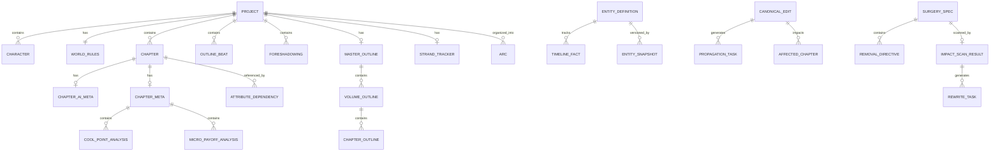

# 📄 Software Design Document (SDD) — VietTruyen v0.1.0

> **Mục đích:** Tài liệu thiết kế duy nhất (Single Source of Truth) cho dự án VietTruyen.
> Tối ưu hóa để cả con người và AI Agent (Claude Code, Codex, Antigravity) đều đọc hiểu chính xác — triệt tiêu hallucination.
>
> **Cập nhật lần cuối:** 2026-04-04

---

## Mục lục

1. [Tổng quan Dự án](#1-tổng-quan-dự-án)
2. [Kiến trúc Công nghệ](#2-kiến-trúc-công-nghệ)
3. [Thiết kế Dữ liệu](#3-thiết-kế-dữ-liệu)
4. [Thiết kế Giao tiếp & API](#4-thiết-kế-giao-tiếp--api)
5. [Luồng Logic Nghiệp vụ](#5-luồng-logic-nghiệp-vụ)
6. [Quy ước Coding & Ràng buộc](#6-quy-ước-coding--ràng-buộc)

---

## 1. Tổng quan Dự án

### 1.1 Mục tiêu

VietTruyen là **ứng dụng desktop hỗ trợ sáng tác truyện chữ (web novel)** dành cho tác giả Việt Nam. Ứng dụng tích hợp AI để:

- Tự động hóa brainstorm ý tưởng, xây dựng nhân vật, thế giới quan
- Viết chương với kiểm soát phong cách, nhịp độ, và tính nhất quán
- Phát hiện mâu thuẫn cốt truyện (Retcon Engine) và theo dõi trí nhớ tự sự (Narrative Memory)
- Phân tích chất lượng đọc (Reading Power), nhịp kể (Strand Weave), và văn phong (Style Learning)
- Chia sẻ truyện lên cộng đồng, nhận phản hồi từ độc giả

### 1.2 Phạm vi (Scope)

#### ✅ In-scope (Phase hiện tại — v0.1.0)

| Domain | Tính năng |
|--------|-----------|
| **Project Management** | CRUD dự án, Bible (logline, genre, tone), nhân vật, thế giới quan, dàn ý |
| **Writing Engine** | Viết chương (create/continue/rewrite/polish), style presets, self-reflection |
| **AI Integration** | Gemini API, OpenRouter, model routing theo task type, prompt cache, token tracking |
| **Narrative Memory** | Entity Timeline (3 lớp), Chapter Dependency Graph, Propagation Engine |
| **Quality Checkers** | 7 checker: consistency, continuity, OOC, pacing, golden-three, high-point, reader-pull |
| **Surprise Engine** | Branch planning, tension levels, divergence tracking, anchor system |
| **Strand Weave** | Theo dõi nhịp Quest/Fire/Constellation, violation detection |
| **Reading Power** | Hook analysis, cool-point patterns, micro-payoffs, hard/soft violations, debt system |
| **Retcon Engine** | Phát hiện mâu thuẫn, canonical edit, blast radius, patch suggestions |
| **Surgery** | Phẫu thuật cốt truyện: impact scan, rewrite queue, source import |
| **Adaptation** | 6 mode phóng tác: reskin, what-if, new-pov, era-shift, surgery, custom |
| **Style Learning** | Tự học lỗi văn phong, tích lũy rules, phân tích chất lượng |
| **Genre Profiles** | Cấu hình hook/cool-point/pacing theo thể loại |
| **Master Outline** | Hệ thống dàn ý 3 tầng (总纲 → 卷纲 → 章纲) |
| **Community** | Publish truyện, comments, error reports |
| **Version Control** | Chapter version history, diff, branching |
| **Export** | Xuất DOCX, PDF, TXT |
| **Auth** | Supabase Auth, guest mode |
| **i18n** | Đa ngôn ngữ (VI, EN) |

#### ❌ Out-of-scope

- Ứng dụng mobile (chỉ hỗ trợ desktop qua Tauri)
- Thanh toán / monetization
- Real-time collaborative editing (nhiều người cùng viết)
- AI image generation cho minh họa truyện
- Marketplace bán truyện

---

## 2. Kiến trúc Công nghệ

### 2.1 Tech Stack

| Layer | Technology | Version | Ghi chú |
|-------|-----------|---------|---------|
| **Runtime** | Tauri | 2.1.0 | Desktop app (macOS dmg/app) |
| **Frontend** | React | 18.3.1 | SPA, TypeScript strict |
| **Build** | Vite | 5.4.1 | Dev server port 1420 |
| **Styling** | TailwindCSS | 3.4.10 | Custom design tokens (Nocturnal Editor) |
| **State** | Zustand | 4.5.5 | 15 stores, no Redux |
| **Local DB** | Dexie (IndexedDB) | 4.3.0 | Offline-first, 4 schema versions |
| **Remote DB** | Supabase | 2.99.3 | Auth, community, sync, versioning |
| **AI** | Google Generative AI | 0.17.1 | Gemini API + OpenRouter proxy |
| **Icons** | Lucide React | 0.436.0 | — |
| **Doc Parse** | mammoth, pdfjs-dist, docx | — | Import/export DOCX, PDF |
| **Test** | Vitest | 2.1.9 | Unit tests, fake-indexeddb |
| **Language** | TypeScript | 5.5.3 | Strict mode, ES2020 target |

### 2.2 Sơ đồ Kiến trúc

```
┌─────────────────────────────────────────────────────────┐
│                    TAURI SHELL (Rust)                    │
│                  com.viettruyen.app                      │
├─────────────────────────────────────────────────────────┤
│                                                         │
│  ┌─────────────┐  ┌──────────────┐  ┌───────────────┐  │
│  │  UI Layer   │  │  App Layer   │  │  Domain Layer │  │
│  │  (React)    │──│  (Stores,    │──│  (Types,      │  │
│  │  Components │  │   Hooks,     │  │   Checkers,   │  │
│  │  Pages      │  │   Lib)       │  │   Engine)     │  │
│  └──────┬──────┘  └──────┬───────┘  └───────────────┘  │
│         │                │                              │
│  ┌──────▼────────────────▼──────────────────────────┐   │
│  │              Infrastructure Layer                 │   │
│  │  ┌──────────┐  ┌───────────┐  ┌───────────────┐  │   │
│  │  │ Dexie DB │  │ Supabase  │  │ AI Proxy      │  │   │
│  │  │ (Local)  │  │ (Remote)  │  │ (localhost:    │  │   │
│  │  │ IndexedDB│  │ Auth/CRUD │  │  3030)         │  │   │
│  │  └──────────┘  └───────────┘  └───────────────┘  │   │
│  └──────────────────────────────────────────────────┘   │
└─────────────────────────────────────────────────────────┘
```

### 2.3 Cấu trúc Thư mục

```
src/
├── App.tsx                 # Root component, routing, layout orchestration
├── main.tsx                # React entry point
├── index.css               # Global styles
├── wizard.css              # Writing wizard styles
├── types/                  # 17 type files — Domain layer contracts
│   ├── story.ts            # Core: Project, Chapter, Character, WorldRules, Arc
│   ├── narrative_memory.ts # 3-layer memory: Entity, Dependency, Propagation
│   ├── reading_power.ts    # Hooks, cool-points, micro-payoffs, violations
│   ├── strand_weave.ts     # Quest/Fire/Constellation pacing
│   ├── chapter_meta.ts     # Extended chapter metadata
│   ├── genre_profile.ts    # Genre-based quality config
│   ├── surprise.ts         # Branch planning, tension, divergence
│   ├── adaptation.ts       # 6 adaptation modes
│   ├── surgery.ts          # Plot surgery: specs, impact, rewrite
│   ├── retcon.ts           # Retcon conflicts and sessions
│   ├── style_learning.ts   # Style corrections and rules
│   ├── workflow.ts         # Workflow intents and sessions
│   ├── community.ts        # Shared stories, comments
│   ├── version_control.ts  # Chapter versions, branches, diffs
│   ├── token_tracker.ts    # AI token usage and costs
│   ├── report.ts           # Reader error reports
│   └── chapter_summary.ts  # Auto-generated summaries
├── db/
│   └── narrative_db.ts     # Dexie DB: 20 tables, 4 schema versions
├── store/                  # 15 Zustand stores
│   ├── use_project_store.ts     # Main project CRUD (largest: 24KB)
│   ├── use_ai_store.ts          # AI config, models, API keys
│   ├── use_auth_store.ts        # Auth state (Supabase + guest)
│   ├── use_narrative_store.ts   # Narrative memory operations
│   ├── use_retcon_store.ts      # Retcon sessions
│   ├── use_surgery_store.ts     # Surgery workflow state
│   ├── use_style_store.ts       # Style learning state
│   ├── use_token_store.ts       # Token usage tracking
│   ├── use_community_store.ts   # Community CRUD
│   ├── use_bible_store.ts       # Bible form state
│   ├── use_notification_store.ts
│   ├── use_i18n_store.ts
│   ├── use_assistant_session_store.ts
│   ├── use_workflow_session_store.ts
│   └── use_writing_wizard_store.ts
├── core/                   # Business logic engines
│   ├── writer_engine.ts    # Style application, text generation
│   ├── reflection.ts       # Self-reflection and consistency
│   ├── exporter.ts         # DOCX/PDF/TXT export
│   ├── memory_extractor.ts # Entity extraction from chapters
│   ├── scene_chunker.ts    # Scene segmentation
│   ├── debt_tracker.ts     # Reading debt tracking
│   ├── id.ts               # UUID generation
│   └── checkers/           # 7 quality checkers + orchestrator
├── lib/
│   ├── ai/                 # 27 AI modules
│   │   ├── ai_client.ts           # Base Gemini API client
│   │   ├── tracked_ai_client.ts   # Token-tracked wrapper
│   │   ├── model_router.ts        # Task-based model selection
│   │   ├── context_builder.ts     # Sliding-window context assembly
│   │   ├── surprise_engine.ts     # Branch planning AI
│   │   ├── chapter_writer_ai.ts   # AI chapter generation
│   │   ├── retcon_analyzer.ts     # Retcon AI analysis
│   │   ├── style_analyzer.ts      # Style quality analysis
│   │   ├── style_learner.ts       # Style rule learning
│   │   ├── outline_planner.ts     # 3-tier outline AI
│   │   ├── plot_qa.ts             # Plot question answering
│   │   └── ...
│   ├── supabase/            # 10 service modules
│   ├── workflow/            # 3 orchestration modules
│   ├── community/
│   ├── document/
│   └── memory/
├── components/
│   ├── layout/              # EtherealLayout, TopMenu, PageHeader
│   ├── pages/               # 23 page components
│   └── shared/              # 20 shared components
├── hooks/                   # Custom hooks
│   ├── use_ai_suggest.ts
│   └── use_translation.ts
├── data/                    # Static data (style presets, genre profiles)
└── workers/                 # Web Workers
```

### 2.4 Hệ thống Design (Nocturnal Editor)

Xem chi tiết tại [`DESIGN.md`](./DESIGN.md). Tóm tắt:

| Token | Value | Dùng cho |
|-------|-------|----------|
| `bg-deep` | `#120f0d` | App background |
| `bg-surface` | `#1a1512` | Content areas, cards |
| `bg-elevated` | `#241c17` | Hover panels, dropdowns |
| `accent-amber` | `#f0c59a` | Primary actions, highlights |
| `accent-teal` | `#2dd4bf` | Success, tags |
| `accent-rose` | `#e8708a` | Warnings, destructive |
| `text-primary` | `#fff6ef` | Main text |
| `text-secondary` | `#c8beb0` | Metadata |
| `text-muted` | `#8f7f73` | Disabled, hints |
| `font-sans` | Manrope | UI framework |
| `font-script` | Newsreader | Story content, prose |

---

## 3. Thiết kế Dữ liệu

### 3.1 Core Entities (TypeScript Contracts)

> **Quy tắc:** Mọi file PHẢI import type từ `src/types/`. KHÔNG được tự bịa tên trường.

#### 3.1.1 Project (Dự án sáng tác)

```typescript
// src/types/story.ts
interface Project {
  id: string;                          // UUID
  title: string;
  logline: string;
  genre: string;
  subGenre: string[];
  writingStyle: string;
  tone: string;
  styleId: string;                     // Liên kết StylePreset
  targetChapters: number;
  endgame: string;
  mainCharacterCount: number;          // 1-10
  supportCharacterCount: number;       // 0-20
  characterSetup: string;
  worldSetting: string;
  mainPlot: string;
  world: WorldRules;                   // Embedded
  characters: Character[];             // Embedded array
  outline: OutlineBeat[];              // Embedded array
  chapters: Chapter[];                 // Embedded (inline) hoặc IndexedDB
  foreshadowings: Foreshadowing[];     // Embedded array
  notes: string;
  canonVersion: number;
  storageMode: 'inline' | 'indexeddb';
  arcCount: number;
  hasGlobalIndex: boolean;
  activeSurgerySpecId?: string;
  lastImpactScanId?: string;
  sourceProjectId?: string;            // Nếu phóng tác
  adaptationType?: AdaptationType;
  genreProfileId?: string;
  genreOverrides?: GenreProfileOverrides;
  strandTracker?: StrandTracker;
  masterOutline?: MasterOutline;       // 3-tier outline
  createdAt: string;                   // ISO 8601
  updatedAt: string;
}
```

#### 3.1.2 Chapter (Chương)

```typescript
interface Chapter {
  id: string;
  title: string;
  summary?: string;
  content: string;
  sequenceNumber?: number;
  status: 'draft' | 'revised' | 'final';
  createdAt: string;
  updatedAt: string;
  aiMeta?: ChapterAiMeta;
  meta?: ChapterMeta;
}

interface ChapterAiMeta {
  runtime: 'quick' | 'ai';
  tensionLevel?: TensionLevel;        // 'follow'|'nudge'|'twist'|'subvert'
  branchId?: string;
  branchSummary?: string;
  divergenceLevel?: DivergenceLevel;  // 'safe'|'warning'|'critical'
  divergenceIssues?: string[];
}
```

#### 3.1.3 Character (Nhân vật)

```typescript
interface Character {
  id: string;
  name: string;
  role: string;
  arc: string;
  currentStage: string;
  traits: string;
  aliases?: string[];
  facts?: StoryFact[];
}
```

#### 3.1.4 WorldRules (Thế giới quan)

```typescript
interface WorldRules {
  geography: string;
  magicSystem: string;
  techLevel: string;
  currency: string;
  factions: string[];
  rules: string;
  facts?: StoryFact[];
}
```

### 3.2 Narrative Memory (3-Layer Architecture)

```
Layer 1: EntitySnapshot     → Trạng thái entity tại mỗi chương
Layer 2: ChapterDependency  → Chương nào dùng attribute nào
Layer 3: PropagationResult   → Blast radius khi sửa entity
```

```typescript
// Layer 1
interface EntityDefinition {
  id: string;
  entityId: string;
  projectId: string;
  entityType: 'character'|'world_element'|'faction'|'item'|'location'|'magic_system'|'world';
  canonicalName: string;
  aliases: string[];
  attributes: Record<string, string>;
  sourceType: 'project'|'chapter_extract'|'canonical_edit'|'ai_enriched';
  confidence: number;
  extractorVersion: string;
  createdAt: string;
  updatedAt: string;
}

// Layer 2
interface AttributeDependency {
  id: string;
  chapterId: string;
  projectId: string;
  chapterIndex: number;
  entityId: string;
  entityType: EntityType;
  attributeKey: string;
  importance: 'critical'|'moderate'|'minor';
  context: string;
  snippets: string[];
  dependencyStatus: 'fresh'|'stale';
  confidence: number;
  contentHash: string;
  createdAt: string;
  updatedAt: string;
}

// Layer 3
interface PropagationResult {
  id: string;
  projectId: string;
  entityId: string;
  entityType: EntityType;
  attributeKey: string;
  oldValue: string;
  newValue: string;
  blastRadius: AffectedChapter[];
  patchSuggestions: PatchSuggestion[];
  taskQueue: PropagationTask[];
  status: 'pending'|'analyzing'|'ready'|'applied'|'cancelled';
  createdAt: string;
}
```

### 3.3 IndexedDB Schema (Dexie v4)

Database name: `narrative-memory-db`

| Table | Primary Key | Indices |
|-------|-------------|---------|
| `chapters` | `id` | `projectId`, `[projectId+index]`, `[projectId+sequenceNumber]`, `status` |
| `entityDefinitions` | `id` | `[projectId+entityId]`, `entityType`, `canonicalName` |
| `timelineFacts` | `id` | `[projectId+entityId]`, `[projectId+entityId+attributeKey]`, `chapterFrom` |
| `chapterDependencies` | `id` | `[projectId+chapterId]`, `[projectId+entityId+attributeKey]`, `dependencyStatus` |
| `chapterMetadata` | `chapterId` | `projectId`, `[projectId+chapterIndex]`, `contentHash` |
| `canonicalEdits` | `id` | `[projectId+entityId+attributeKey]`, `propagationStatus` |
| `propagationTasks` | `id` | `[projectId+chapterId]`, `[projectId+canonicalEditId]`, `status` |
| `propagationLogs` | `id` | `projectId`, `entityId`, `status` |
| `indexJobs` | `id` | `[projectId+status]`, `jobType` |
| `projectIndexState` | `projectId` | `updatedAt` |
| `styleCorrections` | `id` | `[projectId+status]`, `[projectId+chapterId]`, `category` |
| `styleRules` | `id` | `[projectId+category]`, `weight` |
| `projectArcs` | `id` | `[projectId+index]`, `[projectId+chapterStart]` |
| `surgerySpecs` | `id` | `projectId`, `status` |
| `impactScans` | `id` | `projectId`, `specId`, `status` |
| `rewriteTasks` | `id` | `[projectId+status]`, `[projectId+arcId]`, `[projectId+chapterId]` |
| `sourceImportJobs` | `id` | `projectId`, `status` |
| `entitySnapshots` | `id` | `[projectId+entityId]`, `[entityId+chapterIndex]` (legacy) |
| `chapterDeps` | `id` | `[projectId+chapterId]`, `[projectId+entityId]` (legacy) |

### 3.4 Supabase Schema (Remote)

Quản lý bởi `src/lib/supabase/database_types.ts`. Các bảng chính:

- `profiles` — User profiles (auth)
- `shared_stories` — Published stories
- `story_comments` — Reader comments
- `story_reports` — Error reports
- `chapter_versions` — Version history
- `story_branches` — Story branching
- `branch_chapters` — Branch chapter content

### 3.5 Entity Relationship Diagram



---

## 4. Thiết kế Giao tiếp & API

### 4.1 AI Model Router

Hệ thống tự động chọn model theo task type:

```typescript
// src/lib/ai/model_router.ts
type AiTaskType =
  | 'summarize'         // → Fast tier (Gemini Flash)
  | 'classify'          // → Fast
  | 'extract_metadata'  // → Fast
  | 'analyze_retcon'    // → Fast/Balanced
  | 'answer_plot'       // → Fast/Balanced
  | 'brainstorm'        // → Quality tier (Gemini Pro)
  | 'plan_chapter'      // → Quality
  | 'write_chapter'     // → Quality
  | 'polish_style'      // → Balanced
  | 'editor'            // → Quality
  | 'chat';             // → Balanced

// Model tiers: 'fast' | 'balanced' | 'quality'
// Routing: Task → preferred tier order → first available model
```

### 4.2 AI Proxy API

**Base URL:** `http://localhost:3030` (configurable via `VITE_LOCAL_AI_PROXY_URL`)

```
POST /v1/generate
Authorization: Bearer {VITE_LOCAL_AI_PROXY_KEY}
Content-Type: application/json

Request:
{
  "model": "gemini-2.5-flash-preview-05-20",
  "contents": [{ "role": "user", "parts": [{ "text": "..." }] }],
  "generationConfig": { "temperature": 0.7, "maxOutputTokens": 8192 }
}

Response (200):
{
  "candidates": [{ "content": { "parts": [{ "text": "..." }] } }],
  "usageMetadata": { "promptTokenCount": 100, "candidatesTokenCount": 500 }
}

Errors: 400 (bad request), 401 (invalid key), 429 (rate limited), 500 (server error)
```

### 4.3 Supabase API Contracts

#### Auth

```typescript
// Sign in with email
supabase.auth.signInWithPassword({ email, password })
// → { data: { user, session }, error }

// Sign in with OAuth
supabase.auth.signInWithOAuth({ provider: 'google' })

// Sign out
supabase.auth.signOut()
```

#### Community — Publish Story

```typescript
// POST shared_stories
const input: PublishStoryInput = {
  project_id: string,
  title: string,
  logline: string,
  genre: string,
  sub_genre: string[],
  cover_emoji: string,
  chapters: SharedChapter[],    // { title, content }
  characters: SharedCharacter[], // { name, role, arc }
  status: 'published' | 'workshop'
};

// Response: SharedStory with id, user_id, view_count, like_count, timestamps
```

#### Version History

```typescript
// GET chapter versions
supabase.from('chapter_versions')
  .select('*')
  .eq('chapter_id', chapterId)
  .order('version_number', { ascending: false })
// → ChapterVersion[]

// POST save version
supabase.from('chapter_versions').insert({
  chapter_id, project_id, version_number,
  title, content, summary, word_count,
  author_id, change_note
})
```

### 4.4 Zustand Store Contracts

Mỗi store expose interface rõ ràng. Ví dụ `use_project_store`:

```typescript
// Actions exposed (không tự bịa thêm):
createProject(title: string): void
updateProject(id: string, patch: Partial<Project>): void
deleteProject(id: string): void
duplicateProject(id: string): void
setActiveProject(id: string): void

addChapter(projectId: string, chapter: Chapter): void
updateChapter(projectId: string, chapterId: string, patch: Partial<Chapter>): void
removeChapter(projectId: string, chapterId: string): void

addCharacter(projectId: string, character: Character): void
updateCharacter(projectId: string, charId: string, patch: Partial<Character>): void
removeCharacter(projectId: string, charId: string): void

updateWorld(projectId: string, world: Partial<WorldRules>): void
addOutlineBeat(projectId: string, beat: OutlineBeat): void
addForeshadowing(projectId: string, item: Foreshadowing): void
updateMasterOutline(projectId: string, outline: MasterOutline): void
```

---

## 5. Luồng Logic Nghiệp vụ

### 5.1 Full Write Pipeline (Viết chương đầy đủ)

```
Step 1: User chọn chương, tension level, prompt → Dispatch FullWritePipelineIntent
Step 2: WorkflowEngine nhận intent, set step = 'context_building'
Step 3: ContextBuilder thu thập sliding-window context:
        - 5 chương gần nhất (summary)
        - Entity definitions liên quan
        - Active timeline facts
        - Foreshadowings chưa resolved
        - Strand tracker history
        - Genre profile config
Step 4: SurpriseEngine tạo 3 branches (follow/nudge/twist)
        → User chọn branch → set step = 'drafting'
Step 5: ChapterWriterAI gọi Gemini Pro để viết nội dung
        Input: context + branch + style instruction
        Output: ChapterWriteResult { title, content, ledger, divergence }
Step 6: (Optional) step = 'reviewing'
        RunAllCheckers đánh giá: consistency, OOC, pacing, reading-power
        Output: CombinedReviewReport
Step 7: (Optional) step = 'polishing'
        StyleAnalyzer phân tích + StyleLearner áp dụng rules
Step 8: step = 'persisting'
        Save chapter to project store + IndexedDB
        Update strand tracker, chapter meta
Step 9: step = 'completed'
        UI hiển thị chapter + review report + divergence warnings
```

### 5.2 Retcon Engine (Phát hiện mâu thuẫn)

```
Step 1: User thay đổi attribute của entity (VD: tên nhân vật, ngoại hình)
Step 2: Frontend mở RetconImpactModal
Step 3: Tạo CanonicalEdit records: entityId, attributeKey, oldValue → newValue
Step 4: PropagationEngine quét ChapterDependencies:
        - Tìm tất cả chapters reference attributeKey đã thay đổi
        - Phân loại severity: breaking | warning | info
        - Tính blast radius (danh sách AffectedChapter[])
Step 5: Tạo PropagationTask[] cho mỗi affected chapter
Step 6: (Optional) AI tạo PatchSuggestion[]:
        - originalText → suggestedText
        - User review: approve / reject từng patch
Step 7: Apply approved patches → update chapter content
Step 8: Update propagation status = 'applied'
```

### 5.3 Surgery Workflow (Phẫu thuật cốt truyện)

```
Step 1: User tạo SurgerySpec: chọn directives (xóa nhân vật, cắt subplot...)
Step 2: BuildIndex: phân tích chapters thành Arcs + summaries
Step 3: ImpactScan: AI quét blast radius cho mỗi directive
        Output: ImpactScanResult { records[], impactedArcIds[], severity }
Step 4: Generate RewriteTask[] từ impact records
        Types: 'arc_summary' | 'chapter_rewrite' | 'qa_review'
Step 5: User review impact → freeze canon (canonVersion++)
Step 6: Execute rewrite queue: AI rewrite từng chapter theo instructions
Step 7: QA review final
```

### 5.4 Strand Weave Pacing

```
Sau mỗi chương viết:
1. AI classify dominant strand: quest | fire | constellation
2. updateStrandTracker(tracker, chapterStrand)
3. checkStrandViolations():
   - quest_overload: Quest liên tiếp > threshold (genre-dependent)
   - fire_drought: Tuyến tình cảm gián đoạn quá lâu
   - constellation_absent: Thế giới quan vắng mặt
4. Violations hiển thị warning trong UI
5. Genre profile quyết định thresholds:
   - Tiên hiệp: questMax=4, fireGapMax=8
   - Ngôn tình: questMax=6, fireGapMax=3
```

### 5.5 Adaptation Flow (Phóng tác)

```
Step 1: User chọn 1 trong 6 modes:
        reskin | what-if | new-pov | era-shift | surgery | custom
Step 2: Cấu hình AdaptationConfig:
        - sourceProjectId hoặc uploadedSource
        - keepCharacters: 'all'|'selected'|'none'
        - keepWorld, keepOutline, keepForeshadowings
        - mode-specific: divergeAtChapter, newPovCharacterId
Step 3: System tạo Project mới với dữ liệu selective từ source
Step 4: AI generate new bible/characters/outline dựa trên config
Step 5: User review → bắt đầu viết trên project mới
```

### 5.6 Navigation Routing

```typescript
type TabId =
  | 'dashboard'     // DashboardPage
  | 'studio'        // StudioPage (AI workspace)
  | 'projects'      // ProjectsPage
  | 'brainstorm'    // BrainstormPage
  | 'adaptation'    // AdaptationPage
  | 'bible'         // BiblePage
  | 'characters'    // CharactersPage
  | 'world'         // WorldPage
  | 'outline'       // OutlinePage
  | 'writer'        // WriterPage
  | 'chapters'      // ChaptersPage
  | 'foreshadowing' // ForeshadowingPage
  | 'export'        // ExportPage
  | 'analytics'     // AnalyticsPage
  | 'community'     // CommunityPage
  | 'ai-settings'   // AiSettingsPage
  | 'review';       // ReviewPage

// Routing: App.tsx useState<TabId> → EtherealLayout → conditional render
// Không sử dụng React Router — SPA single-state routing
```

---

## 6. Quy ước Coding & Ràng buộc

### 6.1 Naming Conventions

| Loại | Convention | Ví dụ |
|------|-----------|-------|
| **File TypeScript** | `snake_case.ts` | `writer_engine.ts`, `use_project_store.ts` |
| **File Component** | `PascalCase.tsx` | `WriterPage.tsx`, `AiAssistant.tsx` |
| **Interface/Type** | `PascalCase` | `ChapterMeta`, `StrandTracker` |
| **Enum-like type** | `snake_case` string union | `'quest' \| 'fire' \| 'constellation'` |
| **Biến, hàm** | `camelCase` | `getActiveProject()`, `chapterIndex` |
| **Hằng số** | `UPPER_SNAKE_CASE` | `STRAND_IDEAL_DISTRIBUTION`, `COST_PER_1M_INPUT` |
| **Store hook** | `use_<domain>_store.ts` | `use_ai_store.ts` |
| **CSS tokens** | `kebab-case` with prefix | `bg-deep`, `text-primary`, `accent-amber` |

### 6.2 File Header Convention

Mọi file PHẢI có header comment:

```typescript
/**
 * File: <tên_file>
 * Purpose: <mục đích 1 dòng>
 * Layer: <UI | Application | Domain | Infrastructure>
 * Domain: <Domain> → [dependencies]
 */
```

### 6.3 Error Handling

```typescript
// BẮT BUỘC: try/catch ở mọi async operation
try {
  const result = await aiClient.generate(prompt);
  return result;
} catch (error) {
  console.error(`[ERROR] [ModuleName]: ${error instanceof Error ? error.message : error}`);
  // Trả về fallback value hoặc re-throw với context
  throw new Error(`[ModuleName] Failed to generate: ${error}`);
}
```

### 6.4 TypeScript Rules

- **`strict: true`** — Không tắt strict mode
- **`any` is BANNED** — Sử dụng `unknown` + type guard, hoặc define proper interface
- **Import type** — Luôn dùng `import type { X }` cho type-only imports
- **No magic strings** — Dùng type union hoặc const object cho string enums

### 6.5 Testing Requirements

| Loại | Bắt buộc | Framework |
|------|----------|-----------|
| **Logic tính toán** | ✅ Unit test | Vitest |
| **AI prompt assembly** | ✅ Unit test | Vitest |
| **IndexedDB operations** | ✅ Unit test | Vitest + fake-indexeddb |
| **UI components** | ❌ Optional | — |
| **Integration** | ❌ Optional | — |

Ví dụ test pattern:

```typescript
// Colocate: surprise_engine.test.ts bên cạnh surprise_engine.ts
import { describe, it, expect } from 'vitest';

describe('SurpriseEngine', () => {
  it('should generate 3 branches for each tension level', () => { /* ... */ });
  it('should preserve critical anchors in all branches', () => { /* ... */ });
  it('should calculate risk score correctly', () => { /* ... */ });
});
```

### 6.6 Performance Constraints

| Metric | Target |
|--------|--------|
| AI response (Fast tier) | < 3s |
| AI response (Quality tier) | < 15s |
| IndexedDB query | < 100ms |
| UI render (page switch) | < 200ms |
| Bundle size | Monitor via Vite |

### 6.7 Security Rules

- **NO hardcoded API keys** — Mọi key lưu trong `.env.local`, access via `import.meta.env`
- **AI Proxy** — API keys handled server-side, client chỉ gửi proxy key
- **Supabase RLS** — Row Level Security cho tất cả remote tables
- **CSP** — Cấu hình `null` hiện tại (Tauri app), cần review trước production

### 6.8 Git & Branching

- **Main branch:** `main`
- **Commit format:** `<type>: <description>` (feat, fix, refactor, docs, test)
- **No commit:** `node_modules/`, `dist/`, `target/`, `.env.local`

---

## Phụ lục

### A. AI Model Catalog

| Model ID | Provider | Tier | Cost (input/1M) |
|----------|----------|------|-----------------|
| `gemini-2.0-flash` | Gemini | fast | $0.10 |
| `gemini-2.5-flash-preview-05-20` | Gemini | fast | $0.15 |
| `gemini-2.5-pro-preview-05-06` | Gemini | quality | $1.25 |
| `openai/gpt-4o-mini` | OpenRouter | fast | $0.15 |
| `anthropic/claude-3.5-sonnet` | OpenRouter | quality | $3.00 |
| `deepseek/deepseek-chat` | OpenRouter | fast | $0.14 |

### B. Quality Checker Suite

| Checker | Purpose | Severity |
|---------|---------|----------|
| `consistency_checker` | Kiểm tra tính nhất quán nội dung | High |
| `continuity_checker` | Kiểm tra tính liên tục giữa các chương | High |
| `ooc_checker` | Phát hiện nhân vật bất nhất (Out of Character) | High |
| `pacing_checker` | Đánh giá nhịp độ kể chuyện | Medium |
| `golden_three_checker` | Đảm bảo 3 tiêu chí vàng mỗi chương | Medium |
| `high_point_checker` | Phát hiện điểm cao trào | Medium |
| `reader_pull_checker` | Đánh giá sức hút giữ chân độc giả | Medium |

### C. Reading Power Taxonomy

- **5 Hook types:** crisis, mystery, emotion, choice, desire
- **8 Cool-point patterns:** flex_counter, underdog_reveal, underdog_victory, authority_challenge, villain_downfall, sweet_surprise, misunderstanding, identity_reveal
- **7 Micro-payoff types:** information, relationship, ability, resource, recognition, emotion, clue
- **4 Hard violations:** HARD_001 (mất đáy khả đọc), HARD_002 (vi phạm cam kết), HARD_003 (thảm họa tiết tấu), HARD_004 (chân không xung đột)
- **8 Soft suggestions:** SOFT_NEXT_REASON, SOFT_HOOK_ANCHOR, SOFT_HOOK_STRENGTH, SOFT_HOOK_TYPE, SOFT_MICROPAYOFF, SOFT_PATTERN_REPEAT, SOFT_EXPECTATION_OVERLOAD, SOFT_RHYTHM_NATURALNESS

### D. Adaptation Modes

| Mode | Label | Mô tả |
|------|-------|-------|
| `reskin` | Thay áo | Giữ cốt, đổi bối cảnh/thể loại |
| `what-if` | Ngã rẽ | Rẽ nhánh từ chương X |
| `new-pov` | Góc nhìn mới | Kể lại từ nhân vật khác |
| `era-shift` | Thời đại mới | Dời bối cảnh sang thời đại khác |
| `surgery` | Phẫu thuật | Bỏ nhân vật, cắt subplot, rewrite |
| `custom` | Tùy chỉnh | Mix & match tự do |
