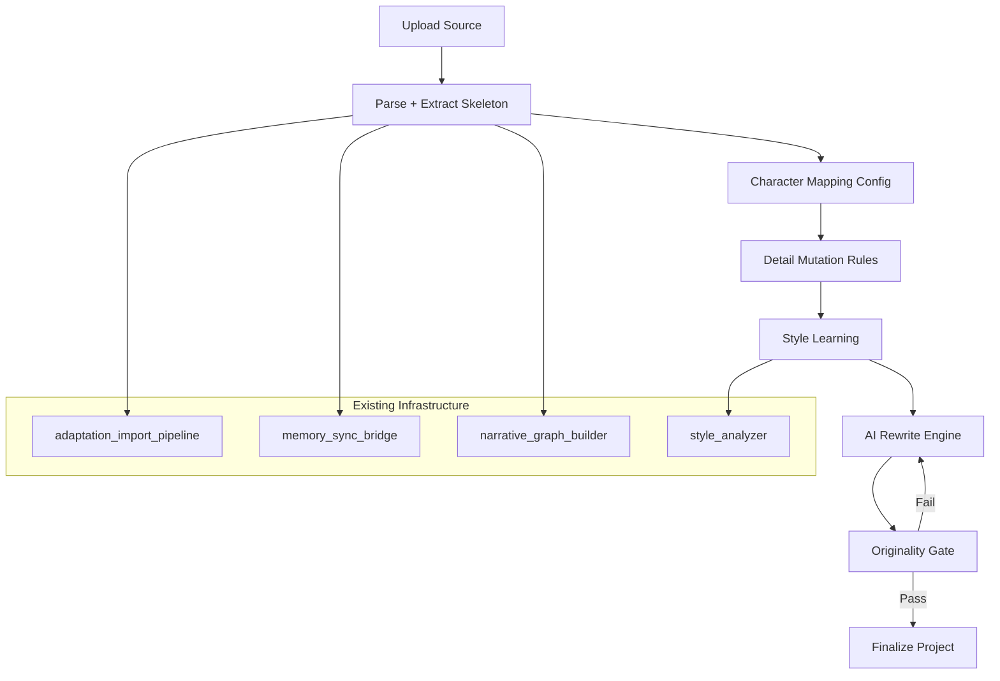
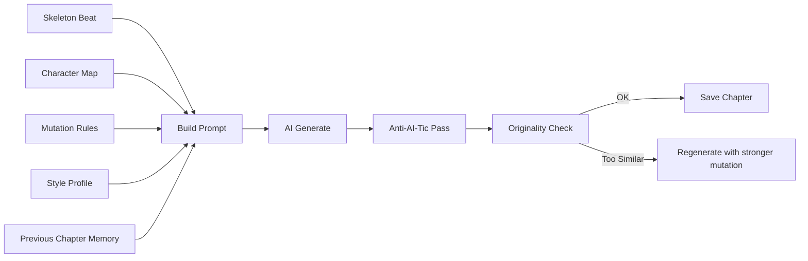

# Hybrid Adaptation — Thiết kế chi tiết

## Tổng quan

Tính năng cho phép người dùng **import truyện gốc làm skeleton**, AI sẽ **viết lại hoàn toàn** với:
- Character mapping (đổi nhân vật + traits)
- Detail mutation (biến đổi bối cảnh, thêm chi tiết hấp dẫn)
- Style learning (học văn phong truyện gốc hoặc style tùy chọn)
- Originality gate (đảm bảo output đủ khác biệt)

**Nguyên tắc cốt lõi:** AI dùng skeleton như *nguồn cảm hứng cấu trúc*, KHÔNG phải template để fill-in. Output phải là tác phẩm sáng tạo mới.

---

## Kiến trúc 5 Layer



---

## Layer 1: Skeleton Extraction

**File:** `src/lib/adaptation/skeleton_extractor.ts`

Trích xuất "xương sống" câu chuyện từ source — KHÔNG giữ nguyên văn, chỉ giữ cấu trúc.

### Interface

```typescript
interface SkeletonBeat {
  chapterIndex: number;
  purpose: 'setup' | 'rising' | 'conflict' | 'climax' | 'falling' | 'resolution';
  plotPoints: string[];        // 3-5 bullet points mô tả SỰ KIỆN (không phải prose)
  characterActions: Array<{
    characterId: string;       // ref to source entity
    role: 'protagonist' | 'antagonist' | 'catalyst' | 'observer';
    action: string;            // "nhân vật X quyết định Y vì Z"
  }>;
  emotionalArc: string;        // "từ hy vọng → thất vọng → quyết tâm"
  hooks: string[];             // foreshadowing, cliffhanger
}

interface StorySkeleton {
  beats: SkeletonBeat[];
  globalArc: string;           // tóm tắt arc tổng 2-3 câu
  thematicCore: string;        // chủ đề cốt lõi
  tensionCurve: number[];      // 0-10 per chapter
}
```

### Logic
- Dùng AI để tóm tắt mỗi chapter thành beat (NOT copy text)
- Leverage existing `narrative_graph_builder` cho character relationships
- Output là abstract structure, không chứa prose gốc

---

## Layer 2: Character Mapping

**File:** `src/lib/adaptation/character_mapper.ts`

### Interface

```typescript
interface CharacterMapping {
  sourceEntityId: string;
  sourceName: string;
  
  // Target character config
  targetName: string;
  targetGender?: string;
  targetBackground: string;     // "con nhà giàu → mồ côi nghèo"
  personalityDelta: string;     // "thêm hài hước, bớt lạnh lùng"
  speechStyle?: string;         // "nói chuyện kiểu gen Z", "cổ kính"
  
  // Relationship transforms
  relationshipChanges?: Array<{
    withCharacterId: string;
    originalRelation: string;   // "sư huynh"
    newRelation: string;        // "đồng nghiệp cùng công ty"
  }>;
}

interface CharacterMappingTable {
  mappings: CharacterMapping[];
  unmappedStrategy: 'auto_generate' | 'remove' | 'keep_generic';
}
```

### UX Flow
1. Sau khi extract entities, hiển thị danh sách nhân vật detected
2. User click từng nhân vật → form mapping (tên mới, traits mới)
3. Hệ thống suggest: nếu đổi bối cảnh tiên hiệp → hiện đại, suggest tên phù hợp
4. Validate: tất cả nhân vật chính phải được map

---

## Layer 3: Detail Mutation Rules

**File:** `src/lib/adaptation/detail_mutation_engine.ts`

### Interface

```typescript
type MutationCategory = 
  | 'setting'      // địa lý, thời đại, công nghệ
  | 'tone'         // nghiêm túc→hài, dark→light
  | 'subplot'      // thêm tuyến phụ
  | 'pacing'       // tăng/giảm nhịp
  | 'spice'        // thêm gia vị: romance, action, mystery
  | 'pov'          // đổi ngôi kể
  | 'detail';      // thêm chi tiết cụ thể

interface MutationRule {
  id: string;
  category: MutationCategory;
  description: string;          // "Chuyển bối cảnh từ tu tiên → cyberpunk"
  intensity: 'subtle' | 'moderate' | 'dramatic';
  applyTo: 'all' | number[];   // all chapters hoặc specific chapters
}

interface MutationConfig {
  rules: MutationRule[];
  globalDirective: string;      // "Thêm nhiều tình tiết lãng mạn, giữ action"
  forbiddenElements: string[];  // "không có harem", "không NTR"
}
```

### Preset Mutations (gợi ý nhanh)
- **Đổi thời đại:** Cổ đại → Hiện đại, Tiên hiệp → Sci-fi
- **Thêm gia vị:** +Romance, +Mystery subplot, +Comic relief
- **Đổi tone:** Serious → Light novel style, Dark → Wholesome
- **Tăng chi tiết:** Thêm miêu tả cảm xúc, thêm world-building

---

## Layer 4: Style Learning (QUAN TRỌNG — theo feedback)

**File:** `src/lib/adaptation/style_transfer.ts`

Đây là layer đảm bảo output **không ra mùi AI** — học văn phong từ source hoặc style reference.

### Interface

```typescript
type StyleSource = 
  | { type: 'from_source'; }                    // học từ truyện gốc đang import
  | { type: 'from_reference'; text: string; }   // học từ đoạn văn mẫu user paste
  | { type: 'preset'; styleId: string; }        // dùng style preset có sẵn
  | { type: 'custom_prompt'; prompt: string; }; // user tự mô tả

interface StyleProfile {
  sentenceLength: 'short' | 'mixed' | 'long';
  dialogueRatio: 'heavy' | 'balanced' | 'sparse';
  descriptionStyle: string;     // "miêu tả cảm quan chi tiết" / "tối giản"
  narrativeVoice: string;       // "ngôi 1 thân mật" / "ngôi 3 toàn tri"
  vocabularyLevel: string;      // "bình dân" / "văn chương" / "gen Z"
  pacing: string;               // "nhanh, nhiều hành động" / "chậm, nội tâm"
  signature: string[];          // đặc trưng riêng: "hay dùng ẩn dụ thiên nhiên"
  antiPatterns: string[];       // "KHÔNG dùng: 'ánh mắt sâu thẳm', 'nụ cười bí ẩn'"
  
  // Raw examples cho few-shot
  exampleParagraphs: string[];  // 3-5 đoạn mẫu từ source
}
```

### Logic
1. Phân tích source text bằng `style_analyzer.ts` (đã có)
2. Trích xuất StyleProfile tự động
3. User có thể override/tune từng thuộc tính
4. StyleProfile được inject vào system prompt của rewrite engine
5. Post-rewrite: chạy `anti_ai_tic` pass để loại bỏ sáo ngữ AI

### Anti-AI-Tic Integration
- Sau mỗi chapter rewrite, chạy `novel_polish_critique` mode `lexical_surgery`
- Detect và replace: "ánh mắt sâu thẳm", "nụ cười bí ẩn", "tim đập thình thịch"
- Replace bằng cách diễn đạt phù hợp với StyleProfile đã học

---

## Layer 5: AI Rewrite Engine

**File:** `src/lib/adaptation/hybrid_rewrite_orchestrator.ts`

### Flow per chapter



### Prompt Construction

```typescript
interface RewritePromptContext {
  skeleton: SkeletonBeat;
  characterMap: CharacterMappingTable;
  mutations: MutationConfig;
  styleProfile: StyleProfile;
  previousChapterSummary: string;   // continuity
  globalContext: string;            // world + arc overview
  
  // CRITICAL: không bao giờ include source prose trong prompt
  // Chỉ include skeleton beats (abstract structure)
}
```

### Quy tắc cứng cho prompt
1. **KHÔNG** paste nguyên văn source vào prompt
2. Chỉ cung cấp: plot points, character actions, emotional arc
3. Yêu cầu AI viết hoàn toàn mới, KHÔNG paraphrase
4. Include style examples (few-shot) từ StyleProfile
5. Include anti-patterns list để AI tránh

---

## Layer 6: Originality Gate

**File:** `src/lib/adaptation/originality_scorer.ts`

### Metrics

```typescript
interface OriginalityReport {
  overallScore: number;           // 0-100, higher = more original
  lexicalOverlap: number;         // % n-gram trùng (target: < 15%)
  structuralSimilarity: number;   // % scene structure giống (target: < 40%)
  semanticDistance: number;       // cosine distance embeddings (target: > 0.6)
  flaggedPassages: Array<{
    outputSpan: string;
    sourceSpan: string;
    similarity: number;
  }>;
  verdict: 'pass' | 'review' | 'fail';
}
```

### Thresholds
- **Pass:** lexical < 15% AND semantic distance > 0.6
- **Review:** lexical 15-30% OR semantic 0.4-0.6 (cần user xem lại)
- **Fail:** lexical > 30% OR semantic < 0.4 (phải rewrite lại)

### Implementation
- N-gram overlap: shingling algorithm (4-gram) — chạy local, không cần AI
- Semantic distance: dùng existing embedding infrastructure
- Chạy per-chapter + aggregate score cho toàn bộ project

---

## UI Flow

### Adaptation Wizard Steps

| Step | Tên | Mô tả |
|------|-----|--------|
| 1 | Upload | Tải file truyện gốc (TXT/DOCX/EPUB) — **đã có** |
| 2 | Phân tích | Parse + extract entities + build graph — **đã có** |
| 3 | Skeleton | Xem skeleton extracted, confirm/edit plot beats — **MỚI** |
| 4 | Character Map | Map nhân vật cũ → mới với traits — **MỚI** |
| 5 | Mutations | Chọn rules biến đổi + thêm gia vị — **MỚI** |
| 6 | Style | Chọn nguồn style + tune profile — **MỚI** |
| 7 | Rewrite | AI viết lại từng chương, user review progressive — **MỚI** |
| 8 | Originality | Kiểm tra độ khác biệt, flag passages cần sửa — **MỚI** |
| 9 | Finalize | Tạo project mới từ output — **đã có (mở rộng)** |

---

## File Structure

```
src/lib/adaptation/
├── adaptation_import_pipeline.ts    (existing - extend)
├── adaptation_preview_project.ts    (existing)
├── derive_adaptation_chapters.ts    (existing)
├── imported_project_recovery.ts     (existing)
├── skeleton_extractor.ts            (NEW)
├── character_mapper.ts              (NEW)
├── detail_mutation_engine.ts        (NEW)
├── style_transfer.ts                (NEW)
├── hybrid_rewrite_orchestrator.ts   (NEW)
├── originality_scorer.ts            (NEW)
└── __tests__/
    ├── skeleton_extractor.test.ts
    ├── character_mapper.test.ts
    ├── detail_mutation_engine.test.ts
    ├── style_transfer.test.ts
    ├── hybrid_rewrite_orchestrator.test.ts
    └── originality_scorer.test.ts

src/types/
├── adaptation.ts                    (extend with new interfaces)

src/components/adaptation/
├── SkeletonReviewStep.tsx           (NEW)
├── CharacterMappingStep.tsx         (NEW)
├── MutationConfigStep.tsx           (NEW)
├── StyleConfigStep.tsx              (NEW)
├── ProgressiveRewriteView.tsx       (NEW)
└── OriginalityReportView.tsx        (NEW)
```

---

## Ưu tiên triển khai

1. **Phase 1 — Core Engine:** Types + skeleton_extractor + character_mapper + originality_scorer
2. **Phase 2 — Style:** style_transfer + anti-AI-tic integration
3. **Phase 3 — Rewrite:** hybrid_rewrite_orchestrator + detail_mutation_engine
4. **Phase 4 — UI:** Wizard steps + progressive rewrite view
5. **Phase 5 — Polish:** Preset mutations, auto-suggest, batch rewrite

---

## Lưu ý quan trọng

### Về văn phong (theo feedback user)
- StyleProfile PHẢI được extract từ source trước khi rewrite
- Mỗi chapter sau khi rewrite PHẢI qua anti-AI-tic pass
- User có thể paste đoạn văn mẫu để AI học theo
- Hệ thống giữ 3-5 example paragraphs trong prompt làm few-shot

### Về bản quyền
- Source text KHÔNG được lưu trong output project
- Skeleton chỉ chứa abstract beats, không chứa prose
- Originality gate là MANDATORY trước khi publish
- Nếu fail originality → block publish, yêu cầu rewrite thêm
