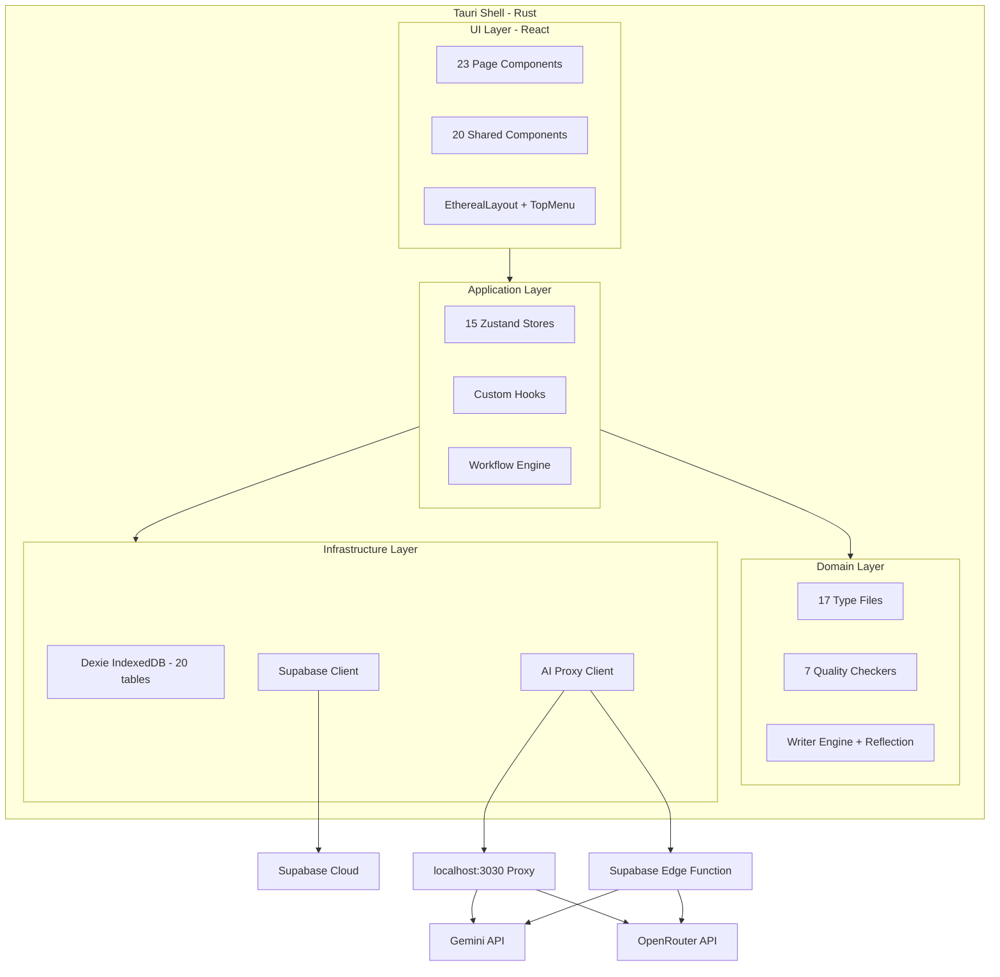
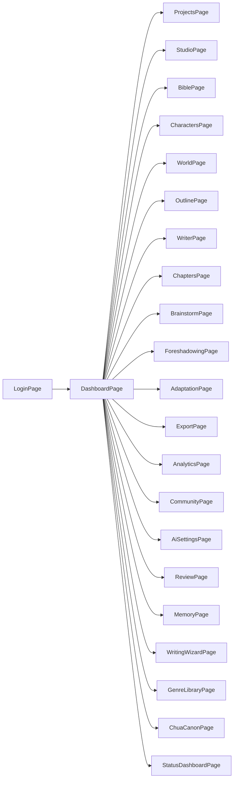
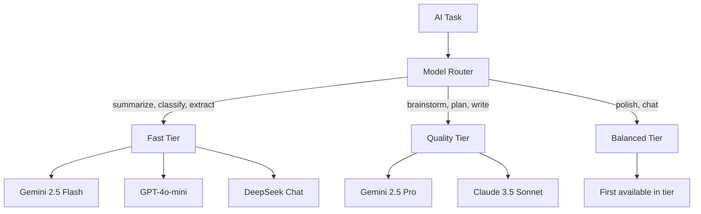

# 🔍 VietTruyen — Project Analysis

> **Date:** 2026-04-04  
> **Version:** v0.1.0  
> **Status:** Active Development

---

## 1. Project Overview

**VietTruyen** is an **AI-powered desktop novel-writing application** targeting Vietnamese web novel authors. It wraps a React SPA inside a **Tauri 2.1** shell, creating a native macOS desktop app (`.dmg`/`.app`). The application integrates deeply with AI (primarily Google Gemini) to assist the entire creative writing lifecycle — from brainstorming and world-building to chapter writing, quality checking, and community publishing.

### Core Value Proposition
- **AI-assisted creative writing** with style control, pacing analysis, and consistency checking
- **Narrative Memory Engine** — a 3-layer system that tracks entities, dependencies, and propagation across potentially 1000+ chapters
- **Retcon Engine** — automatic conflict detection when story elements change
- **Offline-first architecture** with IndexedDB local storage + optional Supabase cloud sync

---

## 2. Tech Stack Summary

| Layer | Technology | Version |
|-------|-----------|---------|
| **Runtime** | [Tauri](src-tauri/tauri.conf.json) | 2.1.0 |
| **Frontend** | React + TypeScript (strict) | 18.3.1 / 5.5.3 |
| **Build** | Vite | 5.4.1 |
| **Styling** | TailwindCSS (Nocturnal Editor theme) | 3.4.10 |
| **State** | Zustand (15 stores) | 4.5.5 |
| **Local DB** | Dexie/IndexedDB (20 tables, 4 schema versions) | 4.3.0 |
| **Remote DB** | Supabase (Auth, Community, Versioning) | 2.99.3 |
| **AI** | Google Generative AI + OpenRouter proxy | 0.17.1 |
| **Tests** | Vitest + fake-indexeddb | 2.1.9 |
| **Doc Parsing** | mammoth, pdfjs-dist, docx | — |

---

## 3. Architecture Diagram



---

## 4. Feature Domains

### 4.1 Project Management
- CRUD projects with full story bible — logline, genre, tone, characters, world rules
- [`Project`](src/types/story.ts:132) is the central entity with embedded characters, chapters, outlines, foreshadowings
- State managed by [`use_project_store`](src/store/use_project_store.ts) — the largest store at ~24KB

### 4.2 Writing Engine
- Full Write Pipeline: context building → surprise branching → AI drafting → review → polish → persist
- [`chapter_writer_ai.ts`](src/lib/ai/chapter_writer_ai.ts) handles AI chapter generation
- [`writer_engine.ts`](src/core/writer_engine.ts) applies style and generates text
- [`context_builder.ts`](src/lib/ai/context_builder.ts) assembles sliding-window context from last 5 chapters + entities + facts

### 4.3 AI Integration
- **Model Router** ([`model_router.ts`](src/lib/ai/model_router.ts)) — automatic model selection per task type across 3 tiers: fast/balanced/quality
- **AI Client** ([`ai_client.ts`](src/lib/ai/ai_client.ts)) — routes through Supabase Edge Function proxy OR local proxy at `localhost:3030`
- **Token Tracking** ([`tracked_ai_client.ts`](src/lib/ai/tracked_ai_client.ts)) — wraps AI calls with usage monitoring
- 27 AI modules covering: brainstorm, outline planning, chapter writing, retcon analysis, style learning, plot QA, surprise engine, etc.

### 4.4 Narrative Memory Engine (3 Layers)
- **Layer 1 — EntitySnapshot:** Entity state at each chapter
- **Layer 2 — ChapterDependency:** Which chapters reference which entity attributes
- **Layer 3 — PropagationResult:** Blast radius when entity changes
- All stored in [`narrative_db.ts`](src/db/narrative_db.ts) with 20 IndexedDB tables

### 4.5 Quality Checker Suite (7 Checkers)
Located in [`src/core/checkers/`](src/core/checkers/):

| Checker | Purpose |
|---------|---------|
| [`consistency_checker`](src/core/checkers/consistency_checker.ts) | Content consistency |
| [`continuity_checker`](src/core/checkers/continuity_checker.ts) | Cross-chapter continuity |
| [`ooc_checker`](src/core/checkers/ooc_checker.ts) | Out-of-character detection |
| [`pacing_checker`](src/core/checkers/pacing_checker.ts) | Pacing evaluation |
| [`golden_three_checker`](src/core/checkers/golden_three_checker.ts) | 3 golden criteria per chapter |
| [`high_point_checker`](src/core/checkers/high_point_checker.ts) | Climax detection |
| [`reader_pull_checker`](src/core/checkers/reader_pull_checker.ts) | Reader engagement scoring |

### 4.6 Retcon Engine
- Detects contradictions when story elements change
- [`RetconImpactModal`](src/components/shared/RetconImpactModal.tsx) provides the UI
- [`retcon_analyzer.ts`](src/lib/ai/retcon_analyzer.ts) performs AI analysis
- Creates canonical edits → propagation tasks → patch suggestions

### 4.7 Surprise Engine
- Generates 3 narrative branches per chapter: follow/nudge/twist/subvert
- [`surprise_engine.ts`](src/lib/ai/surprise_engine.ts) with tension levels and divergence tracking

### 4.8 Surgery Workflow
- Plot surgery: remove characters, cut subplots, rewrite sections
- Full pipeline: spec → index build → impact scan → rewrite queue → QA
- [`rewrite_engine.ts`](src/lib/surgery/rewrite_engine.ts) and [`source_ingest.ts`](src/lib/surgery/source_ingest.ts)

### 4.9 Adaptation System (6 Modes)
- **reskin** — Keep plot, change setting/genre
- **what-if** — Branch from chapter X
- **new-pov** — Retell from another character
- **era-shift** — Move to different era
- **surgery** — Remove/rewrite elements
- **custom** — Mix and match

### 4.10 Community & Publishing
- Publish stories to Supabase-backed community
- Comments, error reports, collaboration
- [`community_service.ts`](src/lib/supabase/community_service.ts) handles CRUD
- Version history with branching support

### 4.11 Additional Features
- **Strand Weave** — Quest/Fire/Constellation pacing analysis with genre-specific thresholds
- **Reading Power** — Hook analysis, cool-point patterns, micro-payoffs, violation detection
- **Style Learning** — Self-learning style correction rules
- **Genre Profiles** — 35+ genre templates including 修仙, 末世, 都市, etc.
- **i18n** — Vietnamese, English, Chinese translations
- **Export** — DOCX, PDF, TXT
- **Writing Wizard** — Guided multi-step story creation flow

---

## 5. Navigation & Routing

The app uses **state-based routing** (no React Router) via [`App.tsx`](src/App.tsx) with `useState<TabId>`. There are **23 pages** organized under [`src/components/pages/`](src/components/pages/):



---

## 6. Data Architecture

### Local Storage — Dexie IndexedDB
- Database: `narrative-memory-db`
- **20 tables** across 4 schema versions
- Designed for **1000+ chapters** scale
- Key tables: `chapters`, `entityDefinitions`, `timelineFacts`, `chapterDependencies`, `canonicalEdits`, `propagationTasks`, `styleCorrections`, `surgerySpecs`

### Remote Storage — Supabase
- `profiles` — User auth
- `shared_stories` — Published community stories
- `story_comments` — Reader feedback
- `chapter_versions` — Version history
- `story_branches` — Story branching

### State Management — 15 Zustand Stores
| Store | Domain |
|-------|--------|
| [`use_project_store`](src/store/use_project_store.ts) | Project CRUD — largest store |
| [`use_ai_store`](src/store/use_ai_store.ts) | AI config, models, API keys |
| [`use_auth_store`](src/store/use_auth_store.ts) | Authentication state |
| [`use_narrative_store`](src/store/use_narrative_store.ts) | Narrative memory ops |
| [`use_retcon_store`](src/store/use_retcon_store.ts) | Retcon sessions |
| [`use_surgery_store`](src/store/use_surgery_store.ts) | Surgery workflow |
| [`use_style_store`](src/store/use_style_store.ts) | Style learning |
| [`use_token_store`](src/store/use_token_store.ts) | Token usage tracking |
| [`use_community_store`](src/store/use_community_store.ts) | Community CRUD |
| [`use_bible_store`](src/store/use_bible_store.ts) | Bible form state |
| [`use_notification_store`](src/store/use_notification_store.ts) | Notifications |
| [`use_i18n_store`](src/store/use_i18n_store.ts) | Language state |
| [`use_assistant_session_store`](src/store/use_assistant_session_store.ts) | AI assistant sessions |
| [`use_workflow_session_store`](src/store/use_workflow_session_store.ts) | Workflow sessions |
| [`use_writing_wizard_store`](src/store/use_writing_wizard_store.ts) | Writing wizard state |

---

## 7. AI Model Routing



---

## 8. Key Business Workflows

### Full Write Pipeline
```
User prompt → Context Building → Surprise Branching → AI Drafting → Quality Review → Style Polish → Persist
```

### Retcon Engine
```
Entity change → Canonical Edit → Dependency Scan → Blast Radius → Patch Suggestions → Apply/Reject
```

### Surgery Workflow
```
Surgery Spec → Build Index → Impact Scan → Rewrite Queue → Canon Freeze → AI Rewrite → QA Review
```

---

## 9. Coding Conventions

- **Files:** `snake_case.ts` for logic, `PascalCase.tsx` for components
- **TypeScript strict mode** — `any` is banned
- **File headers** required with Purpose, Layer, Domain
- **Error handling:** try/catch on all async ops with `[ERROR] [Module]` format
- **Tests:** colocated with source files, Vitest, mandatory for logic/AI prompts/IndexedDB
- **Design system:** Nocturnal Editor theme with warm amber/teal/rose accent colors on dark bg

---

## 10. Project Health Assessment

### Strengths
- **Extremely well-documented** — SDD.md is comprehensive single-source-of-truth
- **Strong type system** — 17 type files with strict TypeScript
- **Layered architecture** — clear separation of UI/App/Domain/Infrastructure
- **Rich feature set** — covers the full novel-writing lifecycle
- **Offline-first** with sync capability
- **AI model flexibility** — multi-provider with automatic routing

### Areas of Attention
- **No React Router** — state-based routing in App.tsx may become complex as pages grow
- **Large project store** (~24KB) — could benefit from splitting
- **AI proxy architecture** — dual mode (local + edge function) adds complexity
- **35+ genre templates** in Chinese — may need Vietnamese/English localization
- **Test coverage** — unit tests exist but are limited (only a few `.test.ts` files observed)
- **CSP security** — noted as `null` in current Tauri config, needs review before production

### Scale Indicators
- 23 pages, 20 shared components, 15 stores, 27 AI modules, 20 DB tables
- This is a **substantial, feature-rich application** — well beyond a typical MVP

---

## 11. Documentation Inventory

| Document | Location | Purpose |
|----------|----------|---------|
| [SDD.md](SDD.md) | Root | Complete Software Design Document |
| [DESIGN.md](DESIGN.md) | Root | UI/UX Design System |
| [AGENTS.md](AGENTS.md) | Root | AI Agent collaboration rules |
| [README.md](README.md) | Root | Project readme |
| [AI_ORCHESTRA_PROTOCOL.md](docs/AI_ORCHESTRA_PROTOCOL.md) | docs/ | AI agent orchestration |
| [POLISH_UX_DESIGN.md](docs/POLISH_UX_DESIGN.md) | docs/ | UX polish guidelines |
| [STITCH_SCREENS.md](docs/STITCH_SCREENS.md) | docs/ | Screen stitch exports |
| Stitch HTML exports | docs/stitch-exports/ | 8 HTML screen mockups |
